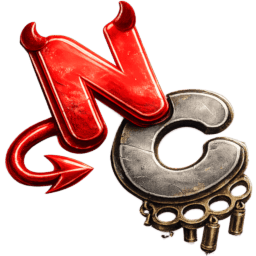

# [](https://github.com/o9ll/nun) Nun

Nun is a modified version of [Equicord](https://equicord.org/) which is capable of running [BetterDiscord](https://betterdiscord.app/) plugins alongside Equicord ones. It only works on Discord Desktop.

## Installing

Windows

- [GUI](https://github.com/o9ll/nun/releases/download/installer/NunInstaller.exe)
- [CLI](https://github.com/o9ll/nun/releases/download/installer/NunInstallerCli.exe)

```shell
sh -c "$(curl -sS https://raw.githubusercontent.com/o9ll/nun/refs/heads/main/misc/install.sh)"
```

## Installing Devbuild

### Dependencies

[Git](https://git-scm.com/download) and [Node.JS LTS](https://nodejs.dev/en/) are required.

## Setup

```sh
npm install -g pnpm
git clone https://github.com/o9ll/nun
cd nun
pnpm install --frozen-lockfile
````

## Build

```sh
pnpm build
pnpm buildWeb
```

## Inject

```sh
pnpm inject -branch canary
```

### Flags

* `-branch stable`
* `-branch ptb`
* `-branch canary`
* `-install-openasar`

```shell
# Install pnpm
npm install -g pnpm

# Clone the repository
git clone https://github.com/o9ll/nun
cd nun

# Install dependencies
pnpm install --frozen-lockfile

# Build
pnpm build

# Build web assets
pnpm buildWeb

# Inject
pnpm inject

# Available flags:
# -branch stable
# -branch ptb
# -branch canary
# -install-openasar
```

## Credits

Thank you to [Vendicated](https://github.com/Vendicated) for creating [Vencord](https://github.com/Vendicated/Vencord).
